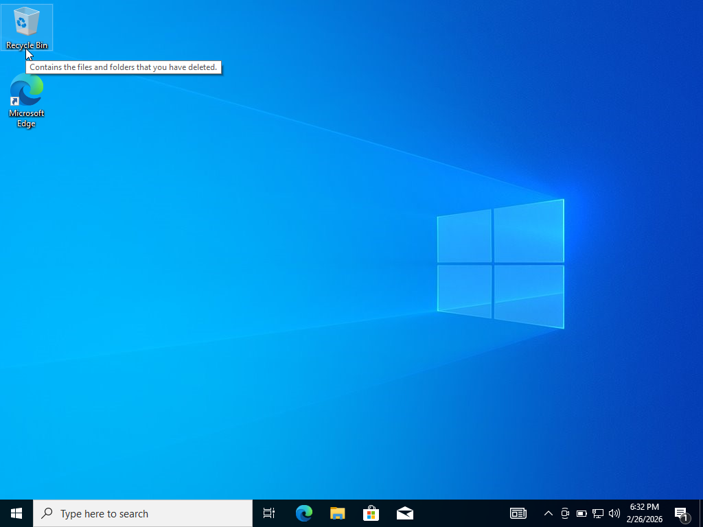
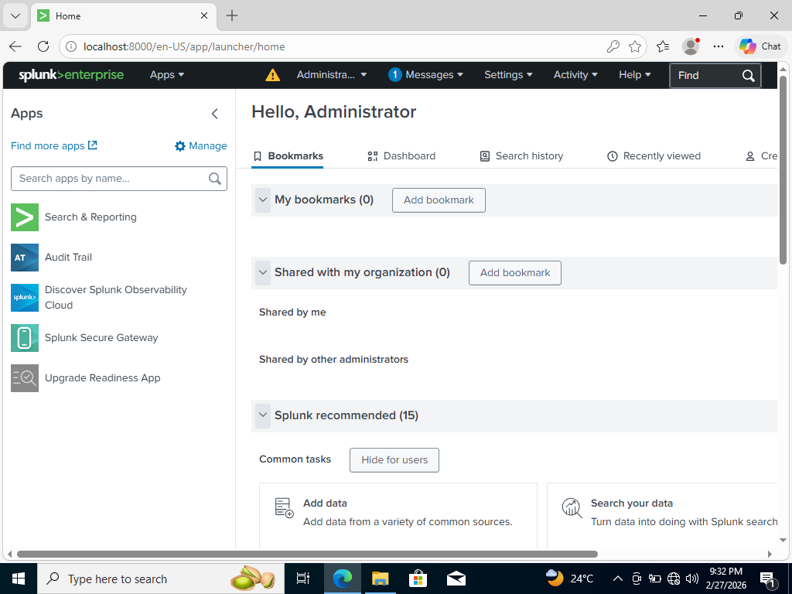
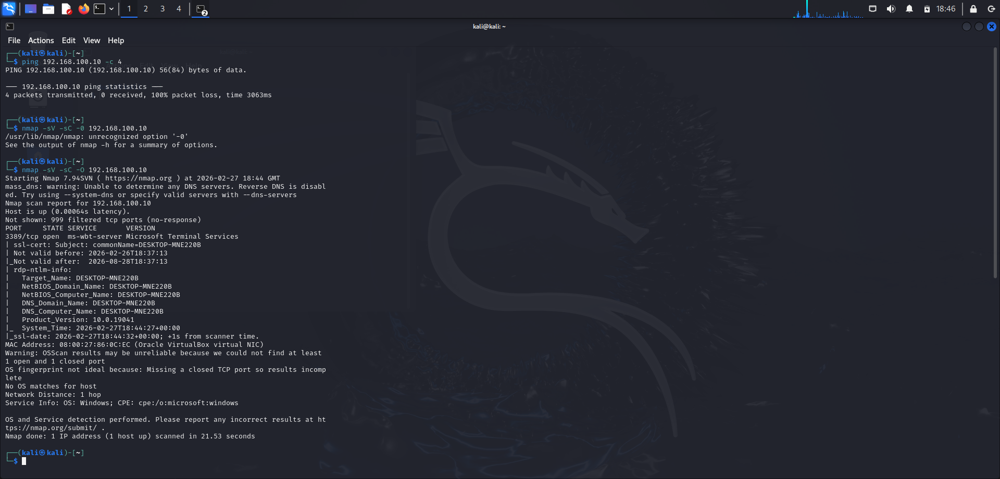
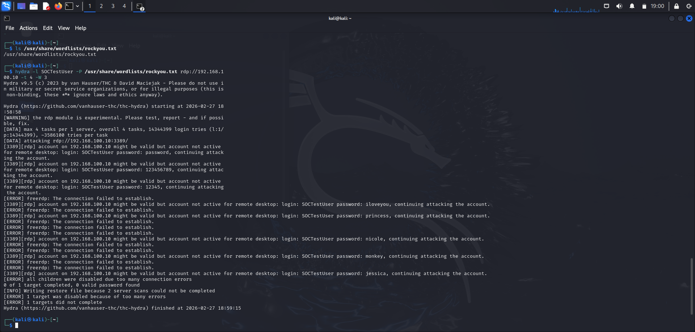
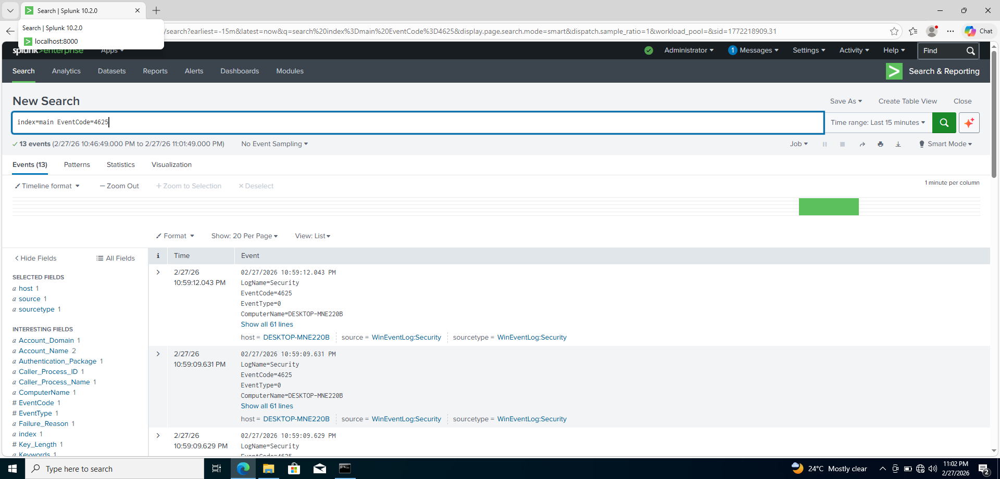
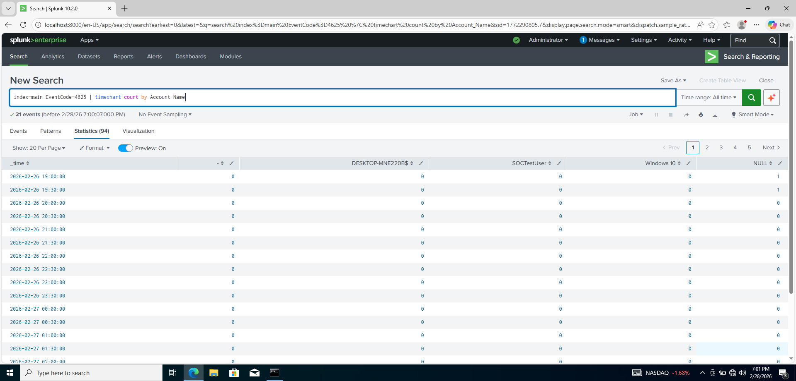
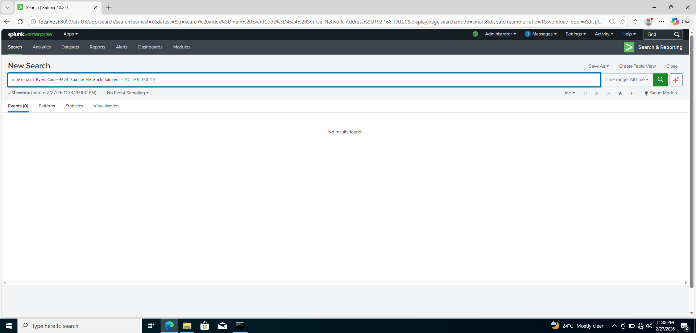

# 🔐 SOC Detection Lab – RDP Brute Force Detection (Splunk)

## 📌 Project Overview

This project simulates a real-world Security Operations Center (SOC) detection scenario.  
A brute force attack was launched against a Windows 10 target machine using Kali Linux, and the activity was successfully detected and analyzed using Splunk SIEM.

The objective of this lab was to demonstrate practical skills in:

- SIEM deployment
- Windows security logging configuration
- Attack simulation
- Detection engineering
- Incident investigation and reporting

---

## 🖥 Lab Environment

| Component | Details |
|-----------|----------|
| SIEM | Splunk Enterprise |
| Target Machine | Windows 10 Pro |
| Attacker Machine | Kali Linux |
| Attack Tool | Hydra |
| Network | Isolated VirtualBox Internal Network |
| Target IP | 192.168.100.10 |
| Attacker IP | 192.168.100.20 |

---

## ⚙️ Lab Architecture

- Two virtual machines configured on an isolated internal network
- Static IP addressing for predictable detection
- Splunk Universal Forwarder collecting:
  - Security Logs
  - System Logs
  - Application Logs
- Windows Audit Policies enabled for:
  - Logon Events (Success & Failure)
  - Process Creation
  - PowerShell Script Block Logging

---

## 🔎 Attack Simulation

### Phase 1 – Reconnaissance
Nmap scan identified open RDP port (3389).

### Phase 2 – Brute Force Attack
Hydra was used to attempt password guessing against the account `SOCTestUser`.

Command used:

```
hydra -l SOCTestUser -P rockyou.txt rdp://192.168.100.10 -t 4 -W 3
```

13 failed login attempts were generated.

---

## 🚨 Detection in Splunk

### Event Detected
- EventCode: 4625
- Description: An account failed to log on
- Source IP: 192.168.100.20
- Target Account: SOCTestUser
- Target Port: 3389 (RDP)

### SPL Query Used

```
index=main EventCode=4625
```

### Brute Force Detection Logic

```
index=main EventCode=4625
| stats count by Source_Network_Address
| where count > 5
```

This rule triggers an alert when more than 5 failed login attempts originate from a single IP address within the search window.

---

## 📊 Investigation Findings

- Total Failed Logins: 13
- No successful login detected (EventCode 4624 = 0 from attacker IP)
- No lateral movement observed
- No data exfiltration
- Attack contained successfully

Severity Assessment: HIGH

---

## 🛡 Containment & Recommendations

- Enable account lockout after 5 failed attempts
- Enforce strong password policy (12+ characters)
- Enable Multi-Factor Authentication (MFA)
- Restrict RDP access to trusted IPs only
- Configure automated Splunk alerts
- Monitor EventCode 4624 from unexpected IP addresses

---

## 📈 Skills Demonstrated

- SIEM deployment and configuration
- Windows audit policy management
- Log ingestion & normalization
- SPL query development
- Brute force detection engineering
- Incident reporting
- SOC investigation workflow

---

## 📁 Repository Structure

```
SOC-Detection-Lab-Splunk/
│
├── Report/
│   └── SOC_Incident_Report.pdf
│
├── Screenshots/
│   ├── Hydra_Attack.png
│   ├── Splunk_Detection.png
│   ├── Attack_Timeline.png
│
└── README.md
```

---

## 📸 Key Evidence

### 🖥 Lab Environment – Windows SOC Machine


### 📊 Splunk SIEM Dashboard


### 🔍 Nmap Scan – RDP Port 3389 Open


### 🔓 Hydra Brute Force Attack in Progress


### 🚨 Splunk Detection – 13 Failed Login Events (4625)


### 📈 Brute Force Timeline Visualization


### 🛡 Detection Rule – Alert Logic


### ✅ Impact Verification – No Successful Login (4624 = 0)


> 📁 Full lab evidence (45 screenshots) available in the `/Screenshots` directory.
---

## ⚠ Disclaimer

All testing was conducted in a fully isolated virtual lab environment for educational and portfolio purposes only. No real systems were targeted.

---

## 👩‍💻 Author

Sana Fathima  
Cybersecurity Student | SOC & Offensive Security Labs
